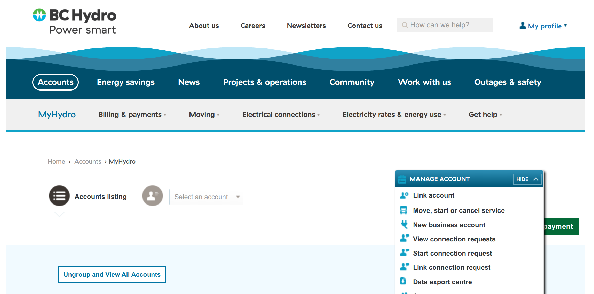
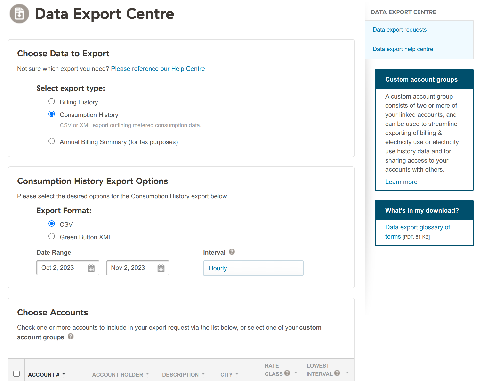

# BC Hydro scripts
Work in progress!

This script takes data exports from BC Hydro and adds it to a database.

## Export Data
To get your account's data exports, go to `Manage Accounts` > `Data export centre`:

Then, select the following:
- **Choose Data to Export**
    - **Select export type**: `Consumption History`.
- **Consumption History Export Options**
    - **Export Format**: `CSV`.
    - **Date Range**: _Choose to your liking, or use default_.
    - **Interval**: `Hourly`.
- **Choose Accounts**: _Select all relevant accounts_.

Hit `Export Data`, and use the `bchydro-db.py` script.

## Script
See `./bchydro-db.py --help` for more info.

## Database Schema
Execute the `bchydro.sql` SQL script to import.
